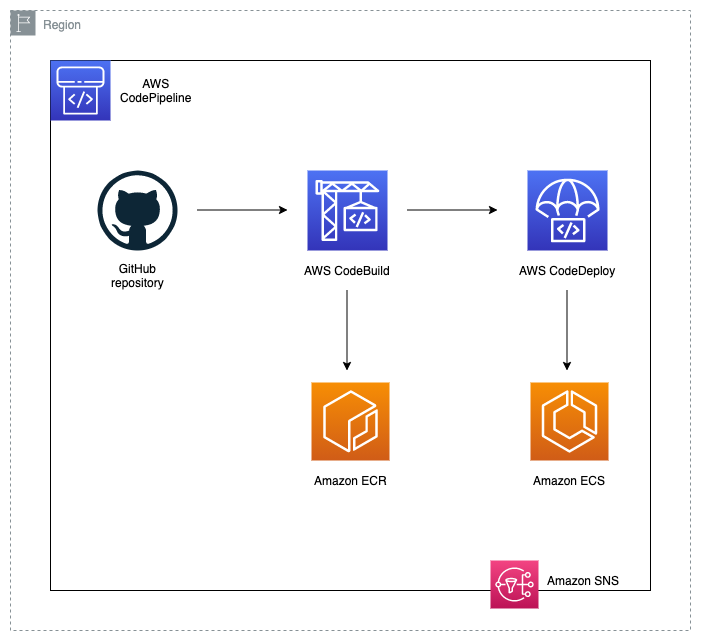

# NorthStar Demo with Amazon ECS, Fargate, and Terraform

## Table of Content

   * [Solution Overview](#solution-overview)
   * [General Information](#general-information)
   * [Infrastructure](#infrastructure)
      * [Infrastructure Architecture](#infrastructure-architecture)
        * [Infrastructure Considerations](#infrastructure-considerations)
      * [CI/CD Architecture](#cicd-architecture)
      * [Prerequisites](#prerequisites)
      * [Usage](#usage)
      * [Autoscaling Test](#autoscaling-test)
   * [Application Code](#application-code)
     * [Client App](#client-app)
       * [Client Considerations](#client-considerations)
     * [Server App](#server-app)
   * [Cleanup](#cleanup)
   * [Security](#security)
   * [License](#license)

## Solution Overview

This repository contains Terraform code to deploy a NorthStar demo. It showcases how AWS resources can be utilized to build a 3 tier architecture that autoscales the Front and Back-end automatically by utilizing fargate.  The code pipeline allows you to update the docker App and deploys using Blue/Green for both front and Back End Clusters.

## General Information

The project is divided into two main parts:
- **Code**: The application code, including:
    - **Client**: Frontend code for the user interface
    - **Server**: Backend code for handling data processing
- **Infrastructure**: Terraform code to deploy the necessary AWS resources

## Infrastructure

The Infrastructure folder contains the Terraform code to deploy the AWS resources. Details of the resources created are as follows:

- AWS Networking resources
- ECS Cluster
- ECS Services
- Task Definitions
- Autoscaling Policies + Cloudwatch Alarms
- Application Load Balancer (Public facing)
- IAM Roles and Policies
- Security Groups
- DynamoDB Table

### Infrastructure Architecture

The architecture diagram and details can be found here:

### Infrastructure Considerations

Additional considerations and customization options for the infrastructure.

## CI/CD Architecture

The CI/CD architecture and details can be found here:

## Prerequisites

Instructions for setting up the environment, including Terraform installation, AWS credentials configuration, etc.

## Usage

Step-by-step guide to deploying the solution using Terraform.

## Autoscaling Test

Instructions for testing autoscaling, if applicable.

## Application Code

### Client App

Details about the client application, including technologies used, structure, etc.

### Client Considerations

Special considerations or customization options for the client application.

### Server App

Details about the server application, including technologies used, structure, etc.

## Cleanup

Instructions for cleaning up resources after the demo.

## Security

Security considerations and best practices.

## License

License information for the project.
